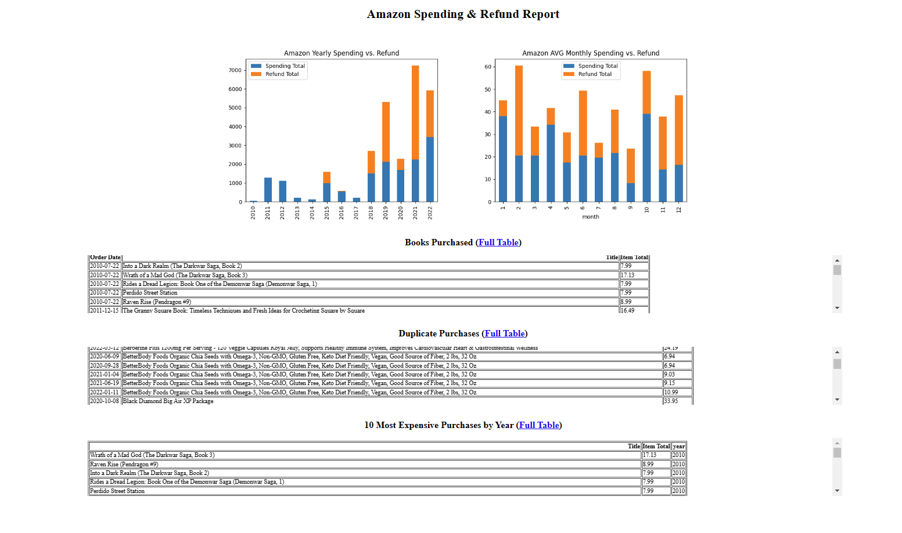

# Amazon Purchases & Returns Data Analysis
 Amazon Spending Data Analysis, by Naoki Watanabe. 12/07/2022
 
 This commandline utility analyses your Amazon spending and refund data and generates nice charts and graphs.
 
 REQUIREMENTS: This requires pyhton 3, and you will need to install some dependencies through pip or whatever: pandas, matplotlib, maybe something else im forgetting.

 Download your Items and Refund report from https://www.amazon.com/b2b/reports and save them as amazon_spending.csv
 and amazon_refund.csv.

 Create a text file named discard_strings.txt and write down words that are included in the title of your purchases that
 you don't want to include in the analysis. List words in separate lines by hitting [Enter] after each word.

 Save the above 3 files in the same directory together with this program.
 _______________________________________________________________________________________________________________________

Note: If you have multiple items with a same title in the same order and returned one of the item, the entire order would be dropped from the 
"Books Purchased", "Duplicate Purchase", "10 Most Expensive Purchases by Year" tables.

Screenshot:

